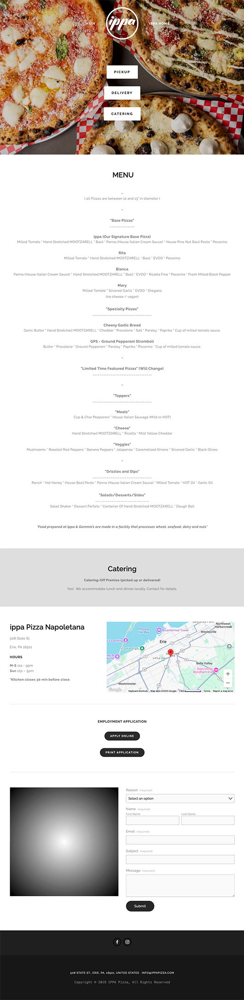
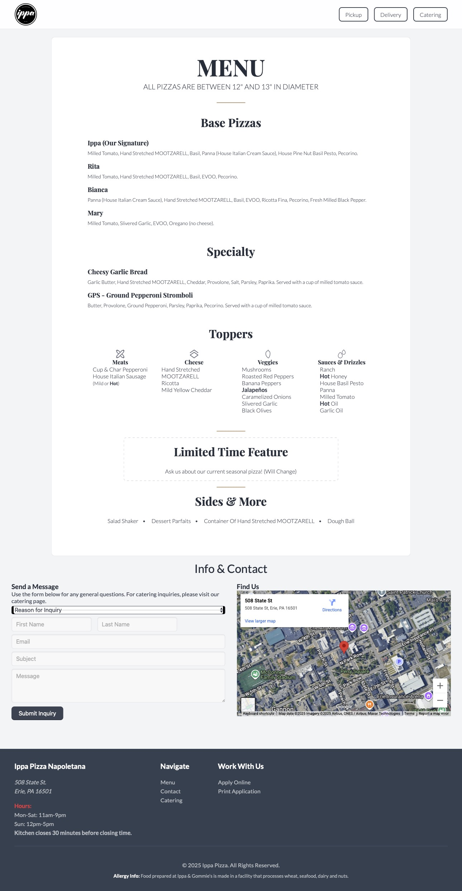

# Ippa Pizza - MENU REDESIGN

## OVERVIEW

This project is a complete redesign and development of the Ippa Pizza website, transforming their original static menu into a modern, responsive, and fully accessible online experience.

## THE PROBLEM

The original Ippa Pizza website featured a menu that was a single, static image. This presented several critical issues for the business and its customers:

- **Poor Accessibility**: Content within these third-party embeds is often difficult for screen readers to navigate, creating a barrier for visually impaired users.
- **Invisible to Seo**: Search engines cannot effectively read or index content that is locked inside an "iframe", making the entire menu invisible for search rankings.
- **Complex Update Process**: To change a menu item, the owner has to log into and manage a completely separate platform, rather than making a simple, direct edit to their own website.
- **Inconsistent User Experience**: The embedded menu didn't match the site's branding and could be slow to load, creating a disjointed and less professional experience for customers.

## MY SOLUTION

The goal was to build a new website from the ground up that solved these problems and provided a polished experience for all users. I started with a fresh concept in Figma and built it out with clean, semantic code.

|              Before (Original Website)              |                        After                         |
| :-------------------------------------------------: | :--------------------------------------------------: |
|  |  |

## KEY FEATURES & IMPROVMENTS

- Fully Responsive Design: The site is perfectly usable on any device, from mobile phones to desktops.

- Semantic & Accessible HTML: Built with semantic HTML5 to ensure it's readable by screen readers and search engines.

- CSS: Styled with modern techniques like Flexbox, Grid, and a maintainable token system using custom properties.

- Custom Iconography: All icons used in the "Toppers" section were designed from scratch in Adobe Illustrator to perfectly match the site's aesthetic.

- Streamlined Navigation: Replaced the oversized original navigation with a modern, minimal bar that is fully responsive and enhances the user experience.

- Dynamic Footer Redesign: During development, I identified an opportunity to improve the user experience by redesigning the footer. The final version is more organized and easier to read than the initial Figma concept, providing clearer access to important information.

- Interactive Contact Form: A professional and user-friendly contact form for customer inquiries.

## TECH I USED

- HTML5 (Semantic & Accessible)

- CSS3 (Custom Properties, Flexbox, Grid)

- Figma (Initial Design & Prototyping)

- Adobe Illustrator (Custom Icon Design)

## LIVE DEMO

### 🔴 **[View Live Site →](https://claudioc.dev/projects/ippa-pizza)**